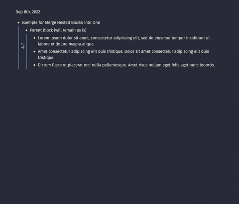

## Merge Nested Blocks into One

Merge all nested blocks into one nested block with line breaks, as if it was written in document mode. 

This is useful if you paste a long form written article and doesn't want it to behave as multiple bullet points.

## Demo

## Icon 

Icon by (Arrow Vectors by Vecteezy)[https://www.vecteezy.com/vector-art/6662126-consolidation-icon-vector-for-graphic-design-logo]
